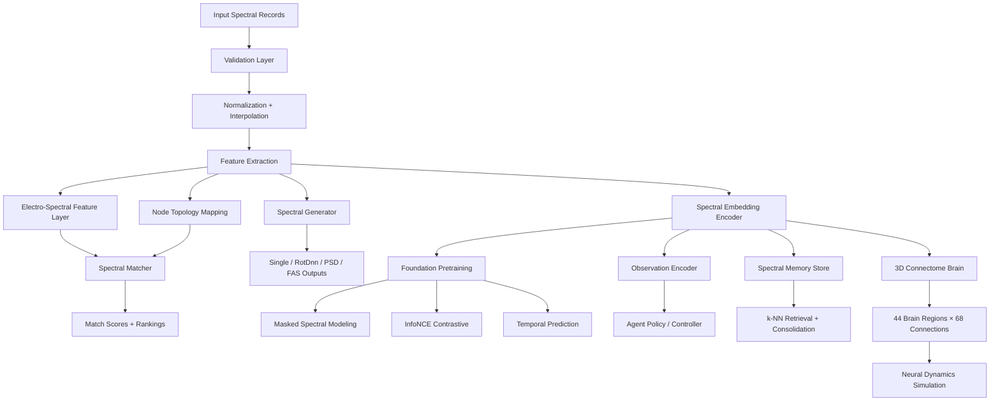

# MESIE — Multi-Element Spectral Intelligence Engine

[](https://opensource.org/licenses/Apache-2.0)
[](https://www.python.org/downloads/)
[](https://zenodo.org)

MESIE is an open-source Python framework for multi-component spectral matching, signal generation, resonance-aware embeddings, foundation pretraining, and AI-native spectral intelligence.

It supports:

- Single-component and multi-component spectral records
- RotDnn-style workflows, PSD and FAS generation
- Spectral validation (6 levels), feature extraction, and matching
- Resonance/coherence scoring and embedding generation
- **Foundation pretraining** — Masked Spectral Modeling, InfoNCE Contrastive Learning, and Temporal Prediction (the spectral equivalent of GPT/BERT/SimCLR)
- **Observation encoder** — raw world → spectra → MESIE embedding → agent observation vector
- **Digital twin environments** — physics-based simulation with RL reward signals
- **Lineage-aware spectral memory** — k-NN retrieval, event/time filtering, importance-weighted consolidation
- **3D connectome brain environment** — 44 real brain regions, 68 biologically-inspired connections, neural simulation engine with conduction delays

## Why MESIE?

Most spectral tools treat spectra as arrays. MESIE treats spectra as **structured computational objects** with components, metadata, lineage, derived features, and embedding-ready representations.

This makes MESIE useful for:

- Earthquake engineering
- Structural monitoring
- Vibration analysis
- Robotics
- Biosignal analysis
- Digital twins
- Artificial intelligence
- Autonomous systems
- Cognitive architectures

## Core Idea

A spectral record can become more than a plotted curve. It can become a reusable memory object, a search vector, a state signature, or a reasoning primitive inside an intelligent system.

MESIE is built on the principle that **the connectome IS the brain, IS the backend, IS the AI, IS the intelligence**. Spectral data flows through a biologically-inspired topology of real brain regions, enabling neural-topology-aware spectral reasoning.

## Installation

```bash
pip install mesie
```

For full functionality (scipy, pandas, scikit-learn, networkx):

```bash
pip install mesie[full]
```

For development:

```bash
pip install -e ".[dev,full]"
```

## Basic Usage

```python
from mesie import load_record, validate_record, match_records

reference = load_record("reference.json")
candidate = load_record("candidate.json")

report = validate_record(reference)
result = match_records(reference, candidate)

print(result.composite_score)
print(result.metric_breakdown)
```

## Generate PSD/FAS

```python
from mesie import generate_psd, generate_fas
from mesie.core.config import GenerationConfig

config = GenerationConfig(seed=42, amplitude_shape="power_law")
psd = generate_psd(config)
fas = generate_fas(config)
```

## Create Spectral Embeddings

```python
from mesie.embeddings import SpectralVectorizer

vectorizer = SpectralVectorizer()
embedding = vectorizer.fit_transform(record)
```

## Cognitive Architecture Integration

```python
from mesie.cognitive import SpectralMemoryAdapter

adapter = SpectralMemoryAdapter()
memory_object = adapter.to_memory_object(record)
# Returns: {semantic_id, spectral_embedding, resonance_signature, coherence_signature, ...}
```

## Foundation Pretraining (Spectral GPT)

MESIE includes a full self-supervised pretraining suite — the spectral equivalent of GPT, BERT, and SimCLR combined:

```python
from mesie.pretraining.foundation_objectives import (
    MaskedSpectralModeling,
    InfoNCEContrastive,
    TemporalPrediction,
    FoundationObjectiveSuite,
)

# Combine all objectives into a unified training loop
suite = FoundationObjectiveSuite(
    masked_weight=1.0,
    contrastive_weight=0.5,
    temporal_weight=0.3,
)
losses = suite.compute_losses(batch)
```

**Objectives:**
- **Masked Spectral Modeling** — Masks random, contiguous, or band-structured frequency regions (spectral BERT)
- **InfoNCE Contrastive Learning** — Augmentation pipelines (noise, frequency masking, amplitude scaling, circular shifts) for positive pair generation (spectral SimCLR)
- **Temporal Prediction** — Predicts future spectral embeddings from past context windows with configurable aggregation strategies

## Observation Encoder (Sensory Cortex)

```python
from mesie.pretraining.observation_encoder import ObservationEncoder

encoder = ObservationEncoder()
observation = encoder.encode(raw_spectral_data, state_vector, semantic_context)
# Output: unified agent observation vector for RL/IL/planning
```

## Digital Twin Environments

```python
from mesie.pretraining.digital_twin import DigitalTwinEnvironment

env = DigitalTwinEnvironment(entity_type="rotating_machinery")
obs = env.reset()
obs, reward, done, info = env.step(action)
# Rewards tied to: resonance avoidance, drift minimization,
#                  coherence maintenance, anomaly detection
```

## Spectral Memory Store

```python
from mesie.pretraining.spectral_memory import SpectralMemoryStore

memory = SpectralMemoryStore(capacity=10000)
memory.store(embedding, event_type="resonance", metadata={"severity": 0.8})
results = memory.query(query_embedding, k=5, event_filter="anomaly")
# Supports: k-NN retrieval, lineage reconstruction, importance-weighted consolidation
```

## 3D Connectome Brain Environment

```python
from mesie.connectome import ConnectomeEnvironment3D, BrainSystem

env = ConnectomeEnvironment3D()  # 44 real brain regions, 68 connections
env.inject_stimulus("V1", amplitude=0.9)      # Visual cortex input
env.inject_stimulus("WER", amplitude=0.8)     # Wernicke's area (language)
env.inject_stimulus("DLPFC_L", amplitude=0.7) # Executive control

states = env.run(duration_ms=50.0)            # Simulate neural dynamics
state_3d = env.get_3d_state()                 # Full 3D state for visualization
# Signal propagation uses ~6 mm/ms conduction velocity
```

## Architecture



## Project Structure

```
mesie/
├── core/          — Data structures and configuration
├── io/            — Loading and exporting records
├── processing/    — Normalization, interpolation, smoothing
├── matching/      — Spectral comparison and scoring
├── generation/    — PSD, FAS, RotDnn, single-component generation
├── features/      — Electro-spectral features, resonance, coherence
├── topology/      — Node mapping and lineage tracking
├── embeddings/    — Spectral vectorization and retrieval
├── cognitive/     — Memory, attention, anomaly, agent-state adapters
├── pretraining/   — Foundation objectives, observation encoder, digital twin, spectral memory
├── connectome/    — 3D brain regions, connectome graph, neural environment simulation
├── validation/    — Multi-level validation
└── visualization/ — Plotting and diagrams
```

## Research Direction

MESIE is designed to support **spectral intelligence**: the use of spectral structures as embeddings, memory objects, retrieval objects, and state signatures in AI systems.

See [docs/research_program.md](docs/research_program.md) for the full research program.

## Citation

If you use MESIE in your research, please cite:

```bibtex
@software{medina2024mesie,
  author = {Medina, Alfredo},
  title = {MESIE: Multi-Element Spectral Intelligence Engine},
  version = {0.1.0},
  year = {2024},
  url = {https://github.com/FreddyCreates/Multi-Element-Spectral-Intelligence-Engine-MESIE-}
}
```

## License

Apache-2.0 — See [LICENSE](LICENSE) for details.

