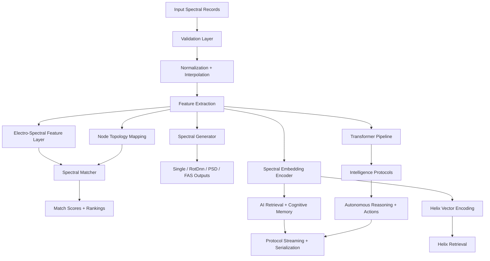

<div align="center">

<h1>
  ⚡ MESIE
  <br/>
  <sub>Multi-Element Spectral Intelligence Engine</sub>
</h1>

<p><em>The open-source science foundation model for spectral intelligence.</em><br/>
Treat every spectrum as a structured computational object — not just an array.</p>

<br/>

[](https://opensource.org/licenses/Apache-2.0)
[](https://www.python.org/downloads/)
[](https://github.com/FreddyCreates/Multi-Element-Spectral-Intelligence-Engine-MESIE-)
[](https://doi.org/10.5281/zenodo.20598320)
[](https://github.com/FreddyCreates/Multi-Element-Spectral-Intelligence-Engine-MESIE-/actions/workflows/ci.yml)
[](deliverables/MESIE_Monte_Carlo_Enterprise_Report.md)
[](deliverables/MESIE_Monte_Carlo_Enterprise_Report.md)

<br/>

[**Quick Start**](#quick-start) · [**Installation**](#installation) · [**Architecture**](#architecture) · [**Benchmarks**](#enterprise-benchmark) · [**Research**](#research-papers) · [**Citation**](#citation)

</div>

---

## What is MESIE?

**MESIE** is an open-source Python foundation model for **spectral intelligence** — a new paradigm in which frequency-domain signals are treated as first-class computational objects rather than flat arrays.

Most spectral tools stop at plotting curves. MESIE goes further: every spectral record becomes a **reusable memory object**, a **search vector**, a **state signature**, and a **reasoning primitive** inside an intelligent system.

Built for scientists and engineers working at the intersection of physics and AI, MESIE provides a full stack — from raw signal ingestion through validation, feature extraction, transformer-based encoding, cross-domain transfer learning, autonomous reasoning, and biologically-inspired connectome simulation.

---

## Capabilities at a Glance

| Layer | Capability |
|---|---|
| 🔬 **Signal Processing** | Multi-component PSD / FAS / RotDnn / single-component records |
| ✅ **Validation** | 6-level hierarchical spectral validation |
| 📐 **Feature Extraction** | Electro-spectral signatures, resonance, coherence, band energy |
| 🔗 **Matching** | Multi-metric composite scoring with topology-aware comparison |
| 🧬 **Embeddings** | Resonance-aware vector representations for AI & retrieval |
| 🤖 **Transformer Pipeline** | Multi-head spectral attention with configurable tokenization |
| �� **Foundation Pretraining** | Masked Spectral Modeling · InfoNCE Contrastive Learning · Temporal Prediction |
| 🌐 **Cross-Domain Transfer** | CORAL + MMD alignment across seismic, EEG, EM, acoustic, structural domains |
| 💡 **Intelligence Protocols** | Passive → Reactive → Adaptive → Predictive → Autonomous reasoning |
| 🧩 **Connectome Simulation** | 44 brain regions · 68 white-matter tracts · biologically realistic propagation |
| 💾 **TAURUS Memory** | Temporal, attention-weighted long-term and working memory |
| 🐙 **Octopus Orchestration** | 8-arm multi-engine controller for complex pipeline coordination |
| 🌐 **Edge Deployment** | Cloudflare Worker API for serverless validation and matching |
| 🖥️ **Desktop App** | Cross-platform Electron GUI (Windows / macOS / Linux) |
| 🔌 **Polyglot Bindings** | Rust · Julia · TypeScript · Motoko (Internet Computer) |

---

## Quick Start

```bash
pip install mesie
```

```python
from mesie import load_record, validate_record, match_records

reference = load_record("reference.json")
candidate = load_record("candidate.json")

report   = validate_record(reference)       # 6-level validation
result   = match_records(reference, candidate)

print(result.composite_score)
print(result.metric_breakdown)
```

---

## Installation

```bash
# Core (NumPy only)
pip install mesie

# Full scientific stack (scipy, pandas, scikit-learn, networkx)
pip install mesie[full]

# ML extras (transformers + torch — skipped on Windows ARM64)
pip install mesie[ml]

# Full AI / intelligence protocols
pip install mesie[intelligence]

# Development
pip install -e ".[dev,full]"
```

---

## Architecture

MESIE is a layered system: raw signals flow through validation, processing, and feature extraction, then fork into matching, generation, embedding, and transformer-based reasoning — all connected by a unified protocol bus.



### Package Layout

```
mesie/
├── core/          — Data structures and configuration
├── io/            — Loading and exporting records
├── processing/    — Normalization, interpolation, smoothing
├── matching/      — Spectral comparison and scoring
├── generation/    — PSD, FAS, RotDnn, single-component generation
├── features/      — Electro-spectral features, resonance, coherence
├── topology/      — Node mapping and lineage tracking
├── embeddings/    — Spectral vectorization and retrieval
├── cognitive/     — TAURUS memory, NeuroCores, attention, agent-state adapters
├── ai/            — Transformer pipeline, intelligence protocols, training, inference, transfer
├── protocols/     — Spectral data protocols, streaming, serialization
├── integration/   — AI system connectors, library bridges, pipeline orchestration
├── helix/         — Helix vector encoding, projection, and retrieval
├── pretraining/   — Foundation objectives, observation encoder, digital twin, spectral memory
├── connectome/    — 3D brain connectome simulation (44 regions, 68 tracts)
├── validation/    — Multi-level validation
└── visualization/ — Plotting and diagrams
```

---

## Core Usage

### Generate PSD / FAS Signals

```python
from mesie import generate_psd, generate_fas
from mesie.core.config import GenerationConfig

config = GenerationConfig(seed=42, amplitude_shape="power_law")
psd = generate_psd(config)
fas = generate_fas(config)
```

### Create Spectral Embeddings

```python
from mesie.embeddings import SpectralVectorizer

vectorizer = SpectralVectorizer()
embedding  = vectorizer.fit_transform(record)
```

---

## Foundation Model Features

### 🤖 Intelligence Protocols — Autonomous Spectral Reasoning

MESIE's intelligence layer supports five levels of autonomous behavior — from passive observation to fully self-directed reasoning:

```python
from mesie import IntelligenceProtocol, IntelligenceConfig, IntelligenceLevel, ReasoningStrategy
import numpy as np

config   = IntelligenceConfig(level=IntelligenceLevel.ADAPTIVE, memory_capacity=500, attention_heads=8)
protocol = IntelligenceProtocol(config)

spectrum = np.random.randn(256)
result   = protocol.reason(spectrum, strategy=ReasoningStrategy.ENSEMBLE)

print(f"Conclusion:          {result.conclusion}")
print(f"Confidence:          {result.confidence:.3f}")
print(f"Evidence:            {result.evidence}")
print(f"Recommended actions: {result.recommended_actions}")
```

| Level | Behavior |
|---|---|
| `Passive` | Observe and record only |
| `Reactive` | Respond to detected anomalies |
| `Adaptive` | Learn from patterns and adjust |
| `Predictive` | Anticipate future spectral states |
| `Autonomous` | Full self-directed reasoning |

---

### 🔬 Spectral Transformer Pipeline

End-to-end transformer encoder architecture optimized for spectral sequences, implemented in pure NumPy (optional PyTorch/HuggingFace via `[intelligence]`):

```python
from mesie import SpectralTransformerPipeline, TransformerConfig, SpectralTokenizer
import numpy as np

config   = TransformerConfig(d_model=128, n_heads=8, n_layers=6, pooling="mean")
pipeline = SpectralTransformerPipeline(config)

spectrum = np.random.randn(512)
output   = pipeline.forward(spectrum)
print(f"Embedding shape: {output.embedding.shape}")
print(f"Attention maps:  {len(output.attention_maps)} layers")

tokenizer = SpectralTokenizer(method="frequency_bins", n_tokens=64)
tokens    = tokenizer.tokenize(spectrum)
```

**Attention interpretability** is built-in for every pipeline:

```python
analysis = pipeline.get_attention_analysis(np.random.randn(128))
# → {n_layers, layer_analyses: [{attention_entropy, max_attention, attention_sparsity}, ...]}
```

| Metric | Meaning |
|---|---|
| Attention entropy | How distributed vs. focused the attention is |
| Max attention | Strength of the strongest attended-to token |
| Attention sparsity | Fraction of near-zero attention weights |

---

### 🧬 Helix Vector Encoding

Hierarchical spectral encoding using helical geometry for efficient vector retrieval:

```python
from mesie import VectorHelix, HelixConfig, HelixRetriever
import numpy as np

config  = HelixConfig(dimensions=64, turns=8)
helix   = VectorHelix(config)
encoded = helix.encode(np.random.randn(256))

retriever = HelixRetriever()
results   = retriever.search(query=encoded, top_k=10)
```

---

### 🏋️ Foundation Pretraining Suite

Three self-supervised training objectives for large-scale spectral pretraining:

| Objective | Description |
|---|---|
| **Masked Spectral Modeling** | Random, contiguous, or band masking — predict held-out spectral content |
| **InfoNCE Contrastive Learning** | Augmentation pipeline (noise, frequency masking, amplitude scaling, circular shifts) |
| **Temporal Prediction** | Configurable context aggregation (weighted, mean, last, concatenated) |

---

### 🌐 Cross-Domain Spectral Transfer

MESIE implements a **cross-domain spectral brain** — a foundation-model-style system that generalizes across wildly different spectral domains using CORAL alignment and MMD minimization:

| Source Domain | Target Domain | Transfer Type |
|---|---|---|
| Earthquake Harmonics | Bridge Vibration Anomalies | Seismic → Structural |
| EEG Oscillations | Audio Resonance Detection | Neural → Acoustic |
| Electromagnetic / RF | Optical Spectroscopy | EM → Optical |
| Climate Atmospheric | Financial Time Series | Cyclic → Market |

```python
from mesie.cognitive import TransferLearningPipeline, SpectralDomain

pipeline = TransferLearningPipeline(shared_dim=64)
pipeline.initialize_with_synthetic(n_samples=1000, n_features=256)

result = pipeline.evaluate_transfer(
    SpectralDomain.SEISMIC,
    SpectralDomain.STRUCTURAL_VIBRATION,
    method="coral"
)
print(f"Transfer efficiency: {result['transfer_efficiency']:.3f}")
print(f"MMD reduction:       {result['mmd_before']:.4f} → {result['mmd_after']:.4f}")

# Auto-discover the optimal strategy between any two domains
strategy = pipeline.find_optimal_transfer_strategy(
    SpectralDomain.ELECTROMAGNETIC,
    SpectralDomain.AUDIO_ACOUSTIC
)
print(f"Best method: {strategy['best_method']}")
```

**What makes this a foundation model:**

1. **Generalization across domains** — train on earthquakes, transfer to bridge vibration
2. **Domain-invariant representations** — shared spectral structure learned across modalities
3. **Multi-hop transfer** — distant domains connected through intermediate spectral spaces
4. **Automatic domain discovery** — compatibility graphs identify the best transfer paths

---

### 🧠 3D Connectome Brain Simulation

MESIE's NeuroAIX engine simulates spectral cognition inside an anatomically grounded brain:

- **44 real brain regions** with MNI 3D coordinates across 10 functional systems
- **68 biologically-inspired white-matter tract connections**
- **Signal propagation** with ~6 mm/ms conduction velocity
- Global coherence metrics and system-level activation tracking
- Full 3D state export for visualization

---

### 💾 TAURUS Memory System

TAURUS (Temporal Adaptive Retrieval and Unified Storage) provides persistent, attention-weighted spectral memory:

```python
from mesie.cognitive import TaurusMemoryStore, TaurusWorkingMemory
import numpy as np

# Long-term memory with temporal decay and attention-weighted retrieval
store = TaurusMemoryStore(capacity=1000)
store.store(embedding=np.random.randn(128), context={"source": "sensor_A"}, importance=0.9)
results = store.retrieve(query=np.random.randn(128), top_k=5)

# Working memory with automatic promotion to long-term storage
working = TaurusWorkingMemory(capacity=7, long_term_store=store)
working.hold(embedding=np.random.randn(128), semantic_tag="transient")
```

---

### 🧩 NeuroCores — Spectral Neural Processing

Self-contained neural processing units combining attention, TAURUS memory, and multi-scale analysis:

```python
from mesie.cognitive import SpectralNeuroCore, NeuroCoreCluster, NeuroCoreConfig
import numpy as np

core   = SpectralNeuroCore(NeuroCoreConfig(d_model=128, n_attention_heads=8))
result = core.process(np.random.randn(256))

# Interpretability
analysis = core.get_attention_analysis()
# → {mean_entropy, mean_max_attention, mean_sparsity, memory_analysis, ...}

# Ensemble across multiple cores
cluster            = NeuroCoreCluster(n_cores=4)
ensemble_embedding = cluster.get_ensemble_embedding(np.random.randn(256))
```

---

### 🔌 AI System Integration

Connect MESIE to external AI systems and orchestrate complex multi-stage pipelines:

```python
from mesie import AISystemConnector, ConnectorConfig, PipelineOrchestrator, OrchestratorConfig

connector   = AISystemConnector(ConnectorConfig(endpoint="local", batch_size=32))
predictions = connector.predict(embeddings)

orchestrator = PipelineOrchestrator(OrchestratorConfig(
    stages=["validate", "extract", "embed", "reason"],
    parallel=True,
))
result = orchestrator.run(records)
```

---

### �� Protocols and Streaming

```python
from mesie import SpectralDataProtocol, StreamingProtocol, SpectralSerializer, SerializationFormat

protocol = SpectralDataProtocol()
message  = protocol.create_message(record, metadata={"source": "sensor_array_1"})

stream = StreamingProtocol(buffer_size=1024)
stream.push(spectrum_chunk)

serializer = SpectralSerializer(format=SerializationFormat.MSGPACK)
payload    = serializer.encode(record)
```

---

### 📊 Experiment Management

```python
from mesie.cognitive import ExperimentPipeline, StatisticalTestSuite

pipeline = ExperimentPipeline(
    name="spectral_classification",
    search_space={
        "lr":     {"type": "float", "range": [0.001, 0.1], "log": True},
        "layers": {"type": "int",   "range": [1, 8]},
    }
)
result = pipeline.optimize(data, labels, n_trials=50)

stats      = StatisticalTestSuite()
ci         = stats.bootstrap_ci(scores, n_bootstrap=1000)
comparison = stats.paired_t_test(method_a_scores, method_b_scores)
```

---

## Deployment

### 🖥️ Desktop Application (Electron)

Cross-platform GUI with spectral visualization, real-time validation, and Monte Carlo benchmarking:

```bash
cd mesie-desktop && npm install && npm start  # production
npm run dev                                    # development + DevTools
npm run build:win | build:mac | build:linux    # distributable
```

See [mesie-desktop/README.md](mesie-desktop/README.md) for full documentation.

---

### ☁️ Cloudflare Worker Edge API

Serverless validate/match API deployed at the edge:

```bash
cd workers/mesie-api && npm install && npx wrangler login && npm run deploy
```

See [workers/mesie-api/README.md](workers/mesie-api/README.md) · Local `wrangler dev` requires x64 (use WSL on Windows ARM).

---

### 🖲️ PowerShell Module

Cross-platform wrapper (Windows PowerShell 5.1+ / PowerShell Core 7+):

```powershell
Import-Module ./scripts/MESIE.psm1

Test-MESIEInstall
Invoke-MESIEValidate    -RecordPath "data/reference/vibration_monitoring_reference.json"
Invoke-MESIEGenerate    -Type psd -Seed 42
Invoke-MESIEMonteCarlo  -Trials 500
Search-MESIEResearch    -Query "spectral analysis" -TopK 5
Start-MESIEDesktop      -Dev
```

---

## Enterprise Benchmark

MESIE is validated across **10 enterprise verticals** via **5,000 stochastic Monte Carlo trials** (500 per vertical):

| # | Industry | Use Case | Result |
|---|---|---|---|
| 1 | Manufacturing | Predictive maintenance — vibration drift detection | ✅ 100% |
| 2 | Energy | Grid & power — Schumann/EM signals under noise | ✅ 100% |
| 3 | Aerospace | Satellite / orbital edge + seismic anchor | ✅ 100% |
| 4 | Insurance | Catastrophe / seismic risk cross-matching | ✅ 100% |
| 5 | Construction | Structural FAS ranking under perturbation | ✅ 100% |
| 6 | Healthcare | Device monitoring — anomaly vs. baseline | ✅ 100% |
| 7 | Robotics | Fleet ANN state lookup | ✅ 100% |
| 8 | Telecom | Spectrum compliance (research + EM libraries) | ✅ 100% |
| 9 | Research | R&D lab benchmark classification | ✅ 100% |
| 10 | Enterprise AI | Agent spectral memory (MAESI + fingerprint) | ✅ 100% |

> **Overall: 100% pass rate — Enterprise grade (≥ 85%): PASS — ~8 s for 5,000 trials**

```bash
# Quick benchmark (2,000 trials)
python scripts/monte_carlo_enterprise_benchmark.py --trials 200

# Full enterprise benchmark (5,000 trials)
python scripts/monte_carlo_enterprise_benchmark.py --trials 500

# Run via pytest (includes long workflow patterns)
pytest tests/test_enterprise_workflows.py -v
```

Full report: [deliverables/MESIE_Monte_Carlo_Enterprise_Report.md](deliverables/MESIE_Monte_Carlo_Enterprise_Report.md)

---

## Research Papers

MESIE is accompanied by a three-paper research series:

| Paper | Title | Topic |
|---|---|---|
| [Paper I](docs/papers/paper_I_de_spectris_mundi.md) | *De Spectris Mundi Cognoscentis* | Spectral Cognitive Substrate Theory — why frequency is the universal basis for cognition |
| [Paper II](docs/papers/paper_II_machina_cogitans.md) | *Machina Cogitans* | The thinking machine — transformer architectures for spectral intelligence |
| [Paper III](docs/papers/paper_III_nexus_intelligentiae.md) | *Nexus Intelligentiae* | Cross-domain transfer and the spectral foundation model |

**Research program:** [docs/research_program.md](docs/research_program.md)

**Core hypothesis:** Spectral records are not merely measurement outputs. Properly encoded, they can serve as retrieval objects, clustering primitives, anomaly detectors, state comparators, simulation memories, and cognitive reasoning primitives inside autonomous agents.

---

## Citation

If you use MESIE in your research, please cite:

```bibtex
@software{medina2026mesie,
  author  = {Medina, Alfredo},
  title   = {MESIE: Multi-Element Spectral Intelligence Engine},
  version = {0.4.0},
  year    = {2026},
  url     = {https://github.com/FreddyCreates/Multi-Element-Spectral-Intelligence-Engine-MESIE-},
  doi     = {10.5281/zenodo.20598320}
}
```

DOI: [10.5281/zenodo.20598320](https://doi.org/10.5281/zenodo.20598320)

---

## Contributing

Contributions are welcome — please read [CONTRIBUTING.md](CONTRIBUTING.md) before opening a pull request.

---

## License

Released under the **Apache 2.0** license. See [LICENSE](LICENSE) for full details.

---

<div align="center">
  <sub>Built with ⚡ by <a href="https://github.com/FreddyCreates">Alfredo Medina</a> and the MESIE Research Collective</sub>
</div>
