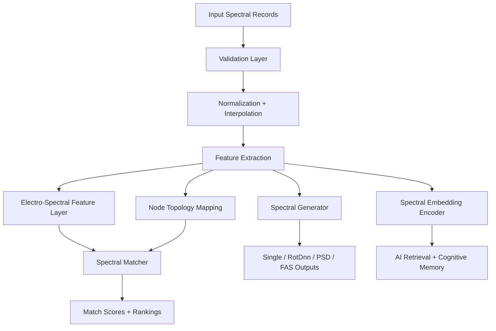

# MESIE — Multi-Element Spectral Intelligence Engine

[](https://opensource.org/licenses/Apache-2.0)
[](https://www.python.org/downloads/)
[](https://zenodo.org)

MESIE is an open-source Python framework for multi-component spectral matching, signal generation, resonance-aware embeddings, and AI-native spectral representation.

It supports:

- Single-component spectral records
- Multi-component records
- RotDnn-style workflows
- PSD-compatible generation
- FAS-compatible generation
- Spectral validation (6 levels)
- Spectral feature extraction
- Frequency-domain matching
- Resonance/coherence scoring
- Embedding generation for AI and cognitive systems

## Why MESIE?

Most spectral tools treat spectra as arrays. MESIE treats spectra as **structured computational objects** with components, metadata, lineage, derived features, and embedding-ready representations.

This makes MESIE useful for:

- Earthquake engineering
- Structural monitoring
- Vibration analysis
- Robotics
- Biosignal analysis
- Digital twins
- Artificial intelligence
- Autonomous systems
- Cognitive architectures

## Core Idea

A spectral record can become more than a plotted curve. It can become a reusable memory object, a search vector, a state signature, or a reasoning primitive inside an intelligent system.

## Installation

```bash
pip install mesie
```

For full functionality (scipy, pandas, scikit-learn, networkx):

```bash
pip install mesie[full]
```

For development:

```bash
pip install -e ".[dev,full]"
```

## Basic Usage

```python
from mesie import load_record, validate_record, match_records

reference = load_record("reference.json")
candidate = load_record("candidate.json")

report = validate_record(reference)
result = match_records(reference, candidate)

print(result.composite_score)
print(result.metric_breakdown)
```

## Generate PSD/FAS

```python
from mesie import generate_psd, generate_fas
from mesie.core.config import GenerationConfig

config = GenerationConfig(seed=42, amplitude_shape="power_law")
psd = generate_psd(config)
fas = generate_fas(config)
```

## Create Spectral Embeddings

```python
from mesie.embeddings import SpectralVectorizer

vectorizer = SpectralVectorizer()
embedding = vectorizer.fit_transform(record)
```

## Cognitive Architecture Integration

```python
from mesie.cognitive import SpectralMemoryAdapter

adapter = SpectralMemoryAdapter()
memory_object = adapter.to_memory_object(record)
# Returns: {semantic_id, spectral_embedding, resonance_signature, coherence_signature, ...}
```

## TAURUS Memory System

TAURUS (Temporal Adaptive Retrieval and Unified Storage) provides persistent, attention-weighted spectral memory for cognitive architectures:

```python
from mesie.cognitive import TaurusMemoryStore, TaurusWorkingMemory
import numpy as np

# Long-term memory with temporal decay and attention-weighted retrieval
store = TaurusMemoryStore(capacity=1000)
store.store(embedding=np.random.randn(128), context={"source": "sensor_A"}, importance=0.9)

# Retrieve by similarity with attention weighting
results = store.retrieve(query=np.random.randn(128), top_k=5)

# Working memory with automatic promotion to long-term storage
working = TaurusWorkingMemory(capacity=7, long_term_store=store)
working.hold(embedding=np.random.randn(128), semantic_tag="transient")
```

## NeuroCores — Spectral Neural Processing

NeuroCores are self-contained neural processing units combining attention, memory (TAURUS), and multi-scale analysis:

```python
from mesie.cognitive import SpectralNeuroCore, NeuroCoreCluster, NeuroCoreConfig
import numpy as np

# Single core with full pipeline
core = SpectralNeuroCore(NeuroCoreConfig(d_model=128, n_attention_heads=8))
result = core.process(np.random.randn(256))

# Access attention analysis for interpretability
analysis = core.get_attention_analysis()
# Returns: {mean_entropy, mean_max_attention, mean_sparsity, memory_analysis, ...}

# Multi-core cluster for ensemble processing
cluster = NeuroCoreCluster(n_cores=4)
ensemble_embedding = cluster.get_ensemble_embedding(np.random.randn(256))
```

## Attention Analysis

The pipeline provides interpretability through `get_attention_analysis()`:

- **Attention entropy**: How distributed vs. focused the attention is
- **Maximum attention**: Strength of the strongest attended-to token
- **Attention sparsity**: Fraction of near-zero attention weights

This enables understanding of what the model focuses on — critical for scientific applications where interpretability is required.

```python
from mesie import SpectralTransformerPipeline, TransformerConfig
import numpy as np

pipeline = SpectralTransformerPipeline(TransformerConfig(d_model=64, n_heads=4))
analysis = pipeline.get_attention_analysis(np.random.randn(128))
# {'n_layers': 4, 'layer_analyses': [{layer, attention_entropy, max_attention, attention_sparsity}, ...]}
```

### What This Enables for AI Systems

1. **Spectral understanding**: Models that truly "understand" spectral structure, not just memorize patterns
2. **Long-range dependency capture**: Detection of harmonics, resonances, and cross-band relationships
3. **Multi-scale analysis**: Simultaneous processing at multiple frequency resolutions
4. **Transfer learning ready**: Pre-trained spectral transformers that transfer across domains
5. **Interpretable attention**: Visualization of model focus for scientific validation
6. **Efficient inference**: Fixed-size embeddings from variable-length spectra
7. **Foundation model potential**: Architecture suitable for large-scale pre-training on diverse spectral data

## Architecture



## Project Structure

```
mesie/
├── core/          — Data structures and configuration
├── io/            — Loading and exporting records
├── processing/    — Normalization, interpolation, smoothing
├── matching/      — Spectral comparison and scoring
├── generation/    — PSD, FAS, RotDnn, single-component generation
├── features/      — Electro-spectral features, resonance, coherence
├── topology/      — Node mapping and lineage tracking
├── embeddings/    — Spectral vectorization and retrieval
├── cognitive/     — TAURUS memory, NeuroCores, attention, agent-state adapters
├── ai/            — Transformer pipeline, intelligence protocols, training
├── validation/    — Multi-level validation
└── visualization/ — Plotting and diagrams
```

## Research Direction

MESIE is designed to support **spectral intelligence**: the use of spectral structures as embeddings, memory objects, retrieval objects, and state signatures in AI systems.

See [docs/research_program.md](docs/research_program.md) for the full research program.

## Citation

If you use MESIE in your research, please cite:

```bibtex
@software{medina2024mesie,
  author = {Medina, Alfredo},
  title = {MESIE: Multi-Element Spectral Intelligence Engine},
  version = {0.1.0},
  year = {2024},
  url = {https://github.com/FreddyCreates/Multi-Element-Spectral-Intelligence-Engine-MESIE-}
}
```

## Cross-Domain Spectral Transfer

MESIE implements a **cross-domain spectral brain** — a foundation-model-style system that generalizes across wildly different spectral domains.

### Multi-Domain Spectral Corpora

Because MESIE uses:
- **CORAL** (CORrelation ALignment) — aligns second-order statistics between domains
- **MMD** (Maximum Mean Discrepancy) — minimizes distribution distance in kernel space
- **Domain-invariant normalization** — whitening transforms that factor out domain-specific characteristics

...it can learn shared structure across wildly different spectral domains.

This is the spectral equivalent of:
- text → code transfer
- image → video transfer
- audio → language transfer

### Supported Transfer Paths

| Source Domain | Target Domain | Transfer Type |
|--------------|---------------|---------------|
| Earthquake Harmonics | Bridge Vibration Anomalies | Seismic → Structural |
| EEG Oscillations | Audio Resonance Detection | Neural → Acoustic |
| Electromagnetic/RF | Optical Spectroscopy | EM → Optical |
| Climate Atmospheric | Financial Time Series | Cyclic → Market |

### Usage

```python
from mesie.cognitive import (
    SpectralDomainGenerator,
    TransferLearningPipeline,
    SpectralDomain,
    CORALTransfer,
    MMDTransfer,
    CrossDomainTransferEngine,
)

# Initialize with multi-domain synthetic corpora
pipeline = TransferLearningPipeline(shared_dim=64)
pipeline.initialize_with_synthetic(n_samples=1000, n_features=256)

# Transfer: earthquake harmonics → bridge vibration anomalies
result = pipeline.evaluate_transfer(
    SpectralDomain.SEISMIC,
    SpectralDomain.STRUCTURAL_VIBRATION,
    method="coral"
)
print(f"Transfer efficiency: {result['transfer_efficiency']:.3f}")
print(f"MMD reduction: {result['mmd_before']:.4f} → {result['mmd_after']:.4f}")

# Transfer: EEG oscillations → audio resonance detection
result = pipeline.evaluate_transfer(
    SpectralDomain.EEG_NEURAL,
    SpectralDomain.AUDIO_ACOUSTIC,
    method="combined"  # CORAL + MMD refinement
)

# Find optimal transfer strategy automatically
strategy = pipeline.find_optimal_transfer_strategy(
    SpectralDomain.ELECTROMAGNETIC,
    SpectralDomain.AUDIO_ACOUSTIC
)
print(f"Best method: {strategy['best_method']}")
```

### What Makes This a Foundation Model

1. **Generalization across domains** — a model trained on earthquake harmonics transfers to bridge vibration anomalies
2. **Shared spectral representations** — domain-invariant encoding learns universal spectral structure
3. **Multi-hop transfer** — distant domains connected through intermediate spectral spaces
4. **Automatic domain discovery** — the system identifies compatible domains via similarity graphs

## Experiment Management

MESIE provides comprehensive experiment tracking and hyperparameter optimization:

```python
from mesie.cognitive import (
    ExperimentPipeline,
    ExperimentConfig,
    SpectralBenchmark,
    DataAugmentation,
    CrossValidationEngine,
    StatisticalTestSuite,
)

# Run optimized experiments with cross-validation
pipeline = ExperimentPipeline(
    name="spectral_classification",
    search_space={
        "lr": {"type": "float", "range": [0.001, 0.1], "log": True},
        "layers": {"type": "int", "range": [1, 8]},
    }
)
result = pipeline.optimize(data, labels, n_trials=50)

# Benchmark with statistical rigor
stats = StatisticalTestSuite()
ci = stats.bootstrap_ci(scores, n_bootstrap=1000)
comparison = stats.paired_t_test(method_a_scores, method_b_scores)
```

## License

Apache-2.0 — See [LICENSE](LICENSE) for details.

