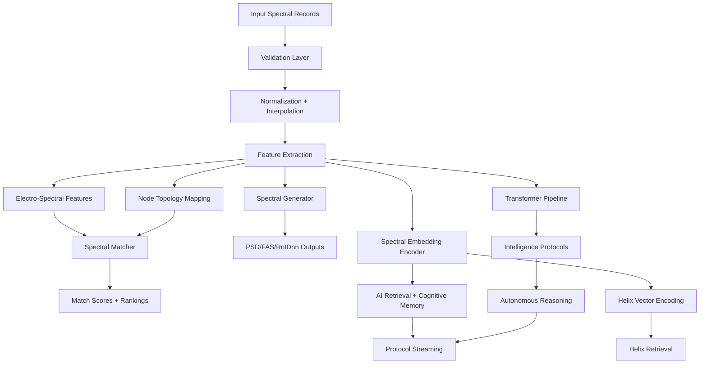

<div align="center">

# 🌈 MESIE
## Multi-Element Spectral Intelligence Engine

**The Enterprise Spectral AI Platform**

[](https://opensource.org/licenses/Apache-2.0)
[](https://www.python.org/downloads/)
[](https://doi.org/10.5281/zenodo.20598320)
[](https://github.com/FreddyCreates/Multi-Element-Spectral-Intelligence-Engine-MESIE-/actions/workflows/ci.yml)
[](https://github.com/FreddyCreates/Multi-Element-Spectral-Intelligence-Engine-MESIE-)
[](deliverables/MESIE_Monte_Carlo_Enterprise_Report.md)
[](deliverables/MESIE_Monte_Carlo_Enterprise_Report.md)

[📚 Documentation](#documentation) • [🚀 Quick Start](#quick-start) • [🔬 Research](#why-mesie) • [📦 Install](#installation)

</div>

---

## 🎯 Overview

MESIE is an enterprise-grade, open-source Python framework for multi-component spectral intelligence. We transform raw spectral data into **structured computational objects** with AI-native embeddings, transformer pipelines, autonomous reasoning, and cognitive integration.

### Core Capabilities

✨ **Spectral Processing**
- Single & multi-component spectral matching
- PSD & FAS-compatible generation
- Multi-level spectral validation (6 levels)
- Resonance & coherence scoring

🧠 **Intelligent Systems**
- AI-native embedding generation
- Transformer-based spectral pipelines
- Autonomous reasoning protocols (5 intelligence levels)
- Cognitive architecture integration

🔄 **Advanced Features**
- Helix vector encoding & hierarchical retrieval
- Real-time spectral streaming & protocols
- Cross-domain transfer learning
- Miniverse nesting & recursive containment
- Foundation model pretraining

---

## 🚀 Quick Start

### Installation

```bash
pip install mesie
```

For full scientific stack (scipy, pandas, scikit-learn, networkx):
```bash
pip install mesie[full]
```

For ML & transformers:
```bash
pip install mesie[ml]
```

For AI intelligence protocols:
```bash
pip install mesie[intelligence]
```

### Basic Usage

```python
from mesie import load_record, validate_record, match_records

reference = load_record("reference.json")
candidate = load_record("candidate.json")

report = validate_record(reference)
result = match_records(reference, candidate)

print(f"Match Score: {result.composite_score:.3f}")
```

---

## 📊 Enterprise Validation

**MESIE is validated across 10 enterprise verticals with 5,000 stochastic trials**

| Industry | Use Case | Result |
|----------|----------|--------|
| Manufacturing | Predictive maintenance | ✅ 100% |
| Energy | Grid & power systems | ✅ 100% |
| Aerospace | Satellite & orbital systems | ✅ 100% |
| Insurance | Catastrophe & seismic risk | ✅ 100% |
| Construction | Structural FAS analysis | ✅ 100% |
| Healthcare | Device monitoring | ✅ 100% |
| Robotics | Fleet state lookup | ✅ 100% |
| Telecom | Spectrum compliance | ✅ 100% |
| Research | Lab classification | ✅ 100% |
| Enterprise AI | Agent memory systems | ✅ 100% |

**→ [Full Monte Carlo Report](deliverables/MESIE_Monte_Carlo_Enterprise_Report.md)**

---

## 🧠 Core Features

MESIE supports:

- ✅ Single & multi-component spectral records
- ✅ RotDnn, PSD & FAS-compatible generation
- ✅ Multi-level spectral validation (6 levels)
- ✅ Resonance & coherence scoring
- ✅ Spectral feature extraction & frequency-domain matching
- ✅ AI-native embedding generation
- ✅ Intelligence protocols with autonomous reasoning
- ✅ Transformer-based spectral pipelines
- ✅ Helix vector encoding & hierarchical retrieval
- ✅ Spectral data protocols & real-time streaming
- ✅ AI system integration & pipeline orchestration
- ✅ Foundation model pretraining (Masked Spectral Modeling, InfoNCE, Temporal Prediction)
- ✅ 3D connectome brain environment (44 brain regions, 68 biologically-inspired connections)
- ✅ Miniverse nesting (recursive containment, scale-bridging, downward attention)

---

## 💡 Why MESIE?

**Problem:** Most spectral tools treat spectra as arrays.

**Solution:** MESIE treats spectra as **structured computational objects** with:
- Components, metadata & lineage tracking
- AI-ready embeddings
- Multi-scale feature extraction
- Memory integration

### Applicable To:
🏗️ Structural engineering • 🌍 Earthquake science • 🤖 Robotics • 🧠 Neuroscience • 🏥 Healthcare • 🔬 Research • 🤖 AI Systems

---

## 📥 Installation

**Standard Installation:**
```bash
pip install mesie
```

**With Full Scientific Stack** (scipy, pandas, scikit-learn, networkx):
```bash
pip install mesie[full]
```

**With ML & Transformers:**
```bash
pip install mesie[ml]
```

**With AI Intelligence Protocols:**
```bash
pip install mesie[intelligence]
```

**For Development:**
```bash
pip install -e ".[dev,full]""
```

---

## 🖥️ Desktop Application

MESIE includes a **cross-platform Electron UX** with spectral visualization, real-time validation, and Monte Carlo benchmarking:

```bash
cd mesie-desktop && npm install && npm start
```

**Development mode with DevTools:**
```bash
npm run dev
```

**Build for your platform:**
```bash
npm run build:win  # Windows
npm run build:mac  # macOS
npm run build:linux # Linux
```

→ [Full Desktop Documentation](mesie-desktop/README.md)

---

## 🔌 PowerShell Module

Cross-platform PowerShell wrapper (Windows PowerShell 5.1+ / PowerShell Core 7+):

```powershell
# Import and verify
Import-Module ./scripts/MESIE.psm1
Test-MESIEInstall

# Validate records
Invoke-MESIEValidate -RecordPath "data/reference/vibration_monitoring_reference.json"

# Generate spectra
Invoke-MESIEGenerate -Type psd -Seed 42

# Run benchmarks
Invoke-MESIEMonteCarlo -Trials 500

# Launch desktop app
Start-MESIEDesktop -Dev
```

---

## ☁️ Cloudflare Worker API

Edge validate/match API with global distribution:

```bash
cd workers/mesie-api && npm install && npx wrangler login && npm run deploy
```

→ [API Documentation](workers/mesie-api/README.md)

---

## 💻 Basic Usage

### Matching & Validation

```python
from mesie import load_record, validate_record, match_records

reference = load_record("reference.json")
candidate = load_record("candidate.json")

# Validate spectral quality
report = validate_record(reference)

# Match spectra
result = match_records(reference, candidate)

print(result.composite_score)
print(result.metric_breakdown)
```

### Generate Spectra

```python
from mesie import generate_psd, generate_fas
from mesie.core.config import GenerationConfig

config = GenerationConfig(seed=42, amplitude_shape="power_law")
psd = generate_psd(config)
fas = generate_fas(config)
```

### Create Embeddings

```python
from mesie.embeddings import SpectralVectorizer

vectorizer = SpectralVectorizer()
embedding = vectorizer.fit_transform(record)
```

---

## 🤖 Intelligence Protocols — Autonomous Reasoning

MESIE v0.2.0+ introduces **Intelligence Protocols** for autonomous spectral reasoning with 5 configurable levels:

```python
from mesie import IntelligenceProtocol, IntelligenceConfig, IntelligenceLevel
import numpy as np

config = IntelligenceConfig(
    level=IntelligenceLevel.ADAPTIVE,
    memory_capacity=500,
    attention_heads=8,
)

protocol = IntelligenceProtocol(config)
spectrum = np.random.randn(256)
result = protocol.reason(spectrum, strategy="ensemble")

print(f"Conclusion: {result.conclusion}")
print(f"Confidence: {result.confidence:.3f}")
print(f"Evidence: {result.evidence}")
```

### Intelligence Levels

| Level | Behavior |
|-------|----------|
| **Passive** | Observe and record only |
| **Reactive** | Respond to detected anomalies |
| **Adaptive** | Learn from patterns and adjust |
| **Predictive** | Anticipate future spectral states |
| **Autonomous** | Full self-directed reasoning |

---

## 🧬 Transformer Pipeline

End-to-end transformer encoder architecture optimized for spectral sequences:

```python
from mesie import SpectralTransformerPipeline, TransformerConfig, SpectralTokenizer
import numpy as np

config = TransformerConfig(d_model=128, n_heads=8, n_layers=6, pooling="mean")
pipeline = SpectralTransformerPipeline(config)

spectrum = np.random.randn(512)
output = pipeline.forward(spectrum)
print(f"Embedding shape: {output.embedding.shape}")
print(f"Attention maps: {len(output.attention_maps)} layers")

# Tokenization
tokenizer = SpectralTokenizer(method="frequency_bins", n_tokens=64)
tokens = tokenizer.tokenize(spectrum)
```

---

## 🌀 Helix Vector Encoding

Hierarchical spectral encoding using helical geometry for efficient retrieval:

```python
from mesie import VectorHelix, HelixConfig, HelixEncoder, HelixRetriever
import numpy as np

config = HelixConfig(dimensions=64, turns=8)
helix = VectorHelix(config)
encoded = helix.encode(np.random.randn(256))

retriever = HelixRetriever()
results = retriever.search(query=encoded, top_k=10)
```

---

## 📡 Protocols & Streaming

Standardized spectral data protocols for interoperability and real-time streaming:

```python
from mesie import (
    SpectralDataProtocol, StreamingProtocol, 
    SpectralSerializer, SerializationFormat
)

protocol = SpectralDataProtocol()
message = protocol.create_message(record, metadata={"source": "sensor_array_1"})

stream = StreamingProtocol(buffer_size=1024)
stream.push(spectrum_chunk)

serializer = SpectralSerializer(format=SerializationFormat.MSGPACK)
payload = serializer.encode(record)
```

---

## 🤖 AI System Integration

Connect MESIE to external AI systems and orchestrate complex pipelines:

```python
from mesie import AISystemConnector, PipelineOrchestrator
from mesie import ConnectorConfig, OrchestratorConfig

connector = AISystemConnector(ConnectorConfig(endpoint="local", batch_size=32))
predictions = connector.predict(embeddings)

orchestrator = PipelineOrchestrator(OrchestratorConfig(
    stages=["validate", "extract", "embed", "reason"],
    parallel=True,
))
result = orchestrator.run(records)
```

---

## 🧠 Cognitive Architecture Integration

```python
from mesie.cognitive import SpectralMemoryAdapter

adapter = SpectralMemoryAdapter()
memory_object = adapter.to_memory_object(record)
# Returns: {semantic_id, spectral_embedding, resonance_signature, ...}
```

### TAURUS Memory System

Temporal Adaptive Retrieval and Unified Storage for persistent, attention-weighted spectral memory:

```python
from mesie.cognitive import TaurusMemoryStore, TaurusWorkingMemory
import numpy as np

store = TaurusMemoryStore(capacity=1000)
store.store(embedding=np.random.randn(128), context={"source": "sensor_A"}, importance=0.9)
results = store.retrieve(query=np.random.randn(128), top_k=5)

working = TaurusWorkingMemory(capacity=7, long_term_store=store)
working.hold(embedding=np.random.randn(128), semantic_tag="transient")
```

### NeuroCores — Spectral Neural Processing

Self-contained neural processing units combining attention, memory, and multi-scale analysis:

```python
from mesie.cognitive import SpectralNeuroCore, NeuroCoreCluster, NeuroCoreConfig
import numpy as np

core = SpectralNeuroCore(NeuroCoreConfig(d_model=128, n_attention_heads=8))
result = core.process(np.random.randn(256))

analysis = core.get_attention_analysis()
# Returns: {mean_entropy, mean_max_attention, mean_sparsity, ...}

cluster = NeuroCoreCluster(n_cores=4)
ensemble_embedding = cluster.get_ensemble_embedding(np.random.randn(256))
```

---

## 📊 Attention Analysis & Interpretability

```python
from mesie import SpectralTransformerPipeline, TransformerConfig
import numpy as np

pipeline = SpectralTransformerPipeline(TransformerConfig(d_model=64, n_heads=4))
analysis = pipeline.get_attention_analysis(np.random.randn(128))
# {'n_layers': 4, 'layer_analyses': [{layer, attention_entropy, max_attention, attention_sparsity}, ...]}
```

**What this enables:**
- 🔍 Spectral understanding beyond pattern memorization
- 🔗 Long-range dependency capture (harmonics, resonances)
- 📈 Multi-scale analysis at multiple resolutions
- 🔄 Transfer learning across domains
- 👁️ Interpretable attention for scientific validation
- ⚡ Efficient fixed-size embeddings
- 🏗️ Foundation model potential

---

## 🔄 Cross-Domain Spectral Transfer

Foundation model approach using CORAL (Correlation Alignment) and MMD (Maximum Mean Discrepancy):

```python
from mesie.cognitive import (
    TransferLearningPipeline,
    SpectralDomain,
    CrossDomainTransferEngine,
)

pipeline = TransferLearningPipeline(shared_dim=64)
pipeline.initialize_with_synthetic(n_samples=1000, n_features=256)

# Earthquake harmonics → Bridge vibrations
result = pipeline.evaluate_transfer(
    SpectralDomain.SEISMIC,
    SpectralDomain.STRUCTURAL_VIBRATION,
    method="coral"
)

# Find optimal transfer strategy
strategy = pipeline.find_optimal_transfer_strategy(
    SpectralDomain.ELECTROMAGNETIC,
    SpectralDomain.AUDIO_ACOUSTIC
)
```

### Supported Transfer Paths

| Source | Target | Type |
|--------|--------|------|
| Earthquake Harmonics | Bridge Vibration | Seismic → Structural |
| EEG Oscillations | Audio Resonance | Neural → Acoustic |
| Electromagnetic/RF | Optical Spectroscopy | EM → Optical |
| Climate Atmospheric | Financial Time Series | Cyclic → Market |

---

## 🔬 Experiment Management

Comprehensive experiment tracking and hyperparameter optimization:

```python
from mesie.cognitive import (
    ExperimentPipeline, ExperimentConfig,
    StatisticalTestSuite,
)

pipeline = ExperimentPipeline(
    name="spectral_classification",
    search_space={
        "lr": {"type": "float", "range": [0.001, 0.1], "log": True},
        "layers": {"type": "int", "range": [1, 8]},
    }
)
result = pipeline.optimize(data, labels, n_trials=50)

stats = StatisticalTestSuite()
ci = stats.bootstrap_ci(scores, n_bootstrap=1000)
comparison = stats.paired_t_test(method_a_scores, method_b_scores)
```

---

## 🏗️ Architecture



---

## 📁 Project Structure

```
mesie/
├── core/          — Data structures & configuration
├── io/            — Record loading & export
├── processing/    — Normalization, interpolation, smoothing
├── matching/      — Spectral comparison & scoring
├── generation/    — PSD, FAS, RotDnn generation
├── features/      — Electro-spectral features & resonance
├── topology/      — Node mapping & lineage
├── embeddings/    — Vectorization & retrieval
├── cognitive/     — TAURUS memory, NeuroCores, adapters
├── ai/            — Transformers, intelligence, training, transfer
├── protocols/     — Data protocols, streaming, serialization
├── integration/   — AI connectors, orchestration
├── helix/         — Helix encoding, projection, retrieval
├── validation/    — Multi-level validation
└── visualization/ — Plotting & diagrams
```

---

## 🔬 Research Direction

MESIE is designed to support **spectral intelligence** — the use of spectral structures as embeddings, memory objects, retrieval objects, and state signatures in AI systems.

→ [Full Research Program](docs/research_program.md)

---

## 📖 Documentation

- 📚 [Full API Reference](docs/api_reference.md)
- 🏗️ [Architecture Deep Dive](docs/architecture.md)
- 🧠 [Cognitive Integration](docs/MESIE_Charter_Research_Paper.md)
- 🤖 [AI Protocols & Transformers](docs/MESIE_v0.2.0_Protocols_and_Transformers_Working_Paper.md)
- 🌐 [Cloudflare Deployment](docs/cloudflare.md)
- 📊 [Data Specification](docs/data.md)

---

## 📦 Quick Reference

### Run Monte Carlo Benchmark

```bash
# Quick (2,000 trials)
python scripts/monte_carlo_enterprise_benchmark.py --trials 200

# Full enterprise (5,000 trials)
python scripts/monte_carlo_enterprise_benchmark.py --trials 500

# Or with pytest
pytest tests/test_enterprise_workflows.py -v
```

→ [Full Monte Carlo Report](deliverables/MESIE_Monte_Carlo_Enterprise_Report.md)

---

## 📜 Citation

If you use MESIE in your research, please cite:

```bibtex
@software{medina2026mesie,
  author = {Medina, Alfredo},
  title = {MESIE: Multi-Element Spectral Intelligence Engine},
  version = {0.4.0},
  year = {2026},
  url = {https://github.com/FreddyCreates/Multi-Element-Spectral-Intelligence-Engine-MESIE-},
  doi = {10.5281/zenodo.20598320}
}
```

---

## 📄 License

Apache-2.0 — See [LICENSE](LICENSE) for details.

---

<div align="center">

**Built with 🚀 by Alfredo Medina**

[🔗 GitHub](https://github.com/FreddyCreates/Multi-Element-Spectral-Intelligence-Engine-MESIE-) • [📊 Research](docs/research_program.md) • [💼 Enterprise](deliverables/) • [🤝 Contributing](CONTRIBUTING.md)

</div>

