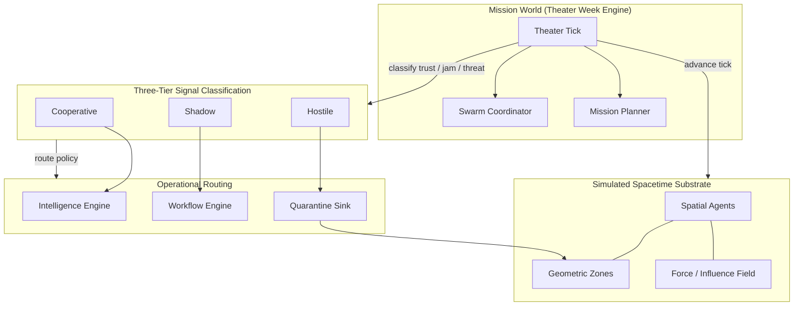
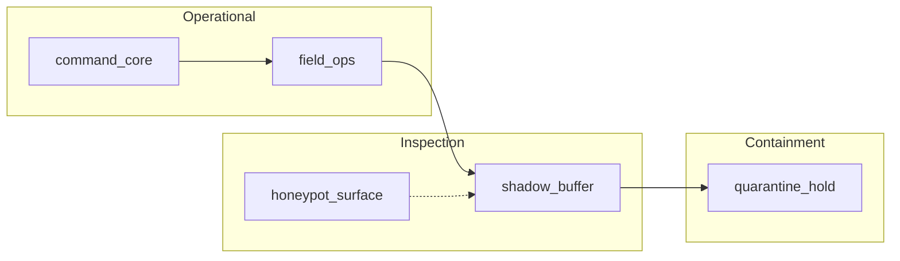
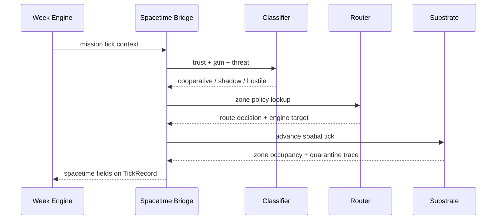

# Paper 04 — Release-Safe Architecture Diagram

**Authority:** `INTERNAL_RESEARCH`  
**Claim boundary:** `repo_verified_architecture`  
**Posture:** Design proposal / experimental framework — not production security

## System overview



## Zone geometry (release-safe names)



## Tick pipeline



## Public claim box

| Element | Safe to publish | Withhold pending IP review |
|---------|-----------------|---------------------------|
| Three-tier model | Yes | Exact threshold tuning |
| Zone role names | Yes (generic) | Operational codenames |
| Agent coordinates | Illustrative only | Live deployment geometry |
| Routing targets | Engine class names | Strategic failover paths |
| Force analogy | Conceptual | Calibrated constants |

## Reproduce

```bash
python scripts/run_spacetime_suite.py
python scripts/run_mission_world_week.py --days 7
```