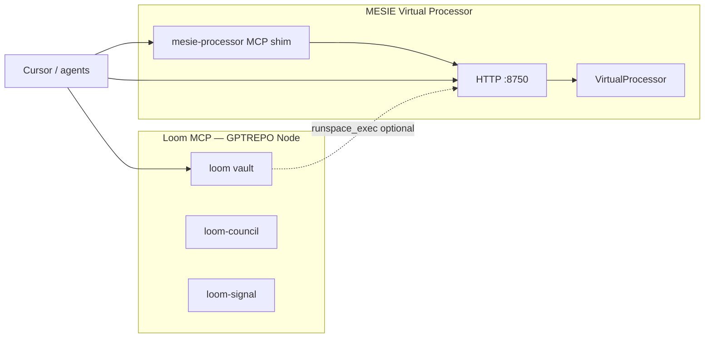

# MESIE Virtual Processor Platform

**Not a regular MCP server.** The Virtual Processor is a **sovereign compute platform** — HTTP-first, LRC-accounted, sandbox-ready — with an *optional* thin MCP shim that proxies to it. Loom (GPTREPO) MCP is separate: vault memory, council, signal bus.

---

## What it is

| Layer | Component | Port / wire |
|-------|-----------|-------------|
| **Core** | `VirtualProcessor` | Python API — embed, match, benchmark, exec_tool, virtual_chip, robotics_pulse |
| **HTTP** | `mesie.processor.server` | `http://127.0.0.1:8750/processor/*` |
| **Accounting** | `LocalAccountingLedger` | `.processor_vault/mint_ledger.json` + `lrc_ledger.jsonl` |
| **MCP shim (optional)** | `mesie.processor.mcp_server` | stdio JSON-RPC → proxies HTTP (name: `mesie-processor`) |
| **Deploy packaging** | `mesie.deploy` | Sandboxes under `deliverables/deploy/sandbox/virtual-processor/` |
| **Background** | `satellite_robotics` | 5-min pulse loop → `deliverables/processor/robotics_satellite.jsonl` |

Design intent: **compute primitives agents invoke — not chat.** No LLM shell inside the processor.

---

## Virtual Processor vs Loom MCP



| | **Loom MCP** | **MESIE Virtual Processor** |
|--|--------------|----------------------------|
| Runtime | Node (`server.mjs` in GPTREPO) | Python + FastAPI |
| Primary role | Sovereign memory, council, signals | Spectral compute + tool exec + LRC |
| Config | `~/.cursor/mcp.json` keys `loom*` | `package_services.py` or `Start-VirtualProcessor.ps1` |
| Data | `~/.medina/` | `.processor_vault/` |
| MCP native? | Yes — full MCP server | Optional shim only; **HTTP is canonical** |

---

## HTTP API

| Method | Path | Purpose |
|--------|------|---------|
| GET | `/processor/status` | Product, ops list, accounting summary |
| GET | `/processor/accounting` | LRC ledger export |
| GET | `/processor/tools` | First 40 native MESIE tools |
| GET | `/processor/nova-runtime` | NOVA runtime state JSON |
| POST | `/processor/embed` | FastSpectralCompute embed one record |
| POST | `/processor/match` | Match two spectral records |
| POST | `/processor/benchmark` | Threat + virtual chip lane |
| POST | `/processor/exec` | Run any `mesie.tools.registry` tool by id |
| POST | `/processor/virtual-chip` | VirtualSiliconChip certify (`chip_id` optional) |
| GET | `/processor/chips` | List chip SKUs + deploy manifest |
| POST | `/processor/robotics-pulse` | Fusion + threat audit pulse |

Every POST returns `ok`, `output`, `latency_ms`, `lrc` (Local Receipt Certificate).

---

## Start commands

```powershell
# One-button (repo root)
.\Start-VirtualProcessor.ps1

# Python module
python -m mesie.processor --serve

# Legacy script
python scripts/run_virtual_processor.py

# Package sandbox (dry-run deploy)
python scripts/package_services.py --service virtual-processor
python scripts/package_services.py --deploy virtual-processor --target local-http --apply
```

Manifest: `deliverables/processor/MESIE_Processor_Manifest.json`

---

## MCP shim (optional)

File: `mesie/processor/mcp_server.py`  
Cursor key (if installed): `mesie-processor`  
Env: `MESIE_PROCESSOR_URL=http://127.0.0.1:8750`

Tools exposed: `processor_status`, `processor_accounting`, `processor_embed`, `processor_benchmark`, `processor_exec`, `processor_list_chips`, `processor_virtual_chip`

**Install snippet only** (not auto-applied):  
`deliverables/deploy/sandbox/virtual-processor/mcp-snippet.json`

```bash
python scripts/package_services.py --deploy virtual-processor --target cursor-mcp --apply
```

Protected: never overwrites `loom`, `loom-council`, `loom-signal` in `~/.cursor/mcp.json`.

---

## Service mesh ports

| Service | Port |
|---------|------|
| Memory Desk (external) | 8740 |
| **Virtual Processor** | **8750** |
| Medina Surface | 8760 |
| Coding Lab (external) | 8770 |
| NOVAMINI HTTP (example) | 6180 |

Surface catalog: `medina_surface invoke --system processor --action status` (when HTTP is up).

---

## Sandbox / deploy packaging

```
deliverables/deploy/sandbox/virtual-processor/
  bundle.json       # ready=true, port, command, checksums
  manifest.json     # status + sample
  launcher.ps1      # Start script
  mcp-snippet.json  # optional Cursor MCP config
```

Master index: `deliverables/deploy/MESIE_Service_Catalog.json`

---

## Deliverable versioning (all suites)

Reruns **never silently overwrite**. Before each write:

1. Prior canonical files → `runs/{timestamp}_{run_key}/`
2. Lineage ledger → `lineage/LINEAGE_{run_key}.json`
3. New run written to timestamp folder **and** canonical path

Synthesis after the June 24 partial rerun:  
`trust/production_readiness/synthesis/Deliverable_Run_Synthesis.md`

```bash
python scripts/synthesize_deliverable_runs.py
```

---

## What was lost in the June 24 partial rerun (summary)

See full synthesis JSON for field-level detail. Headlines:

- **Theater state:** 56 ticks (full week, peak 10K agents) → 8 ticks (day-1 ISR only). Days 2–7 ops missing from partial run; **both snapshots preserved** under `library/mission_worlds/runs/`.
- **Native AI sov_del:** Same structure; `vault_export` / `last_entry` payloads smaller in partial run (~9KB less JSON detail). Vault counter grew (535 vs 232) but export snapshot was thinner. **Both snapshots preserved** under `deliverables/native_ai/sovereign_local/runs/`.
- **Canonical paths restored** to committed full runs; partial runs kept for audit.

---

## Dependencies

```bash
pip install mesie[server]   # fastapi, uvicorn, pydantic
```

---

## Related tools

| Tool id | Command |
|---------|---------|
| `virtual-processor` | `python -m mesie.processor --serve` |
| `processor-benchmarks` | `python scripts/run_processor_benchmarks.py` |
| `robotics-satellite` | `python -m mesie.processor.satellite_robotics` |
| `service-package` | `python scripts/package_services.py --all` |
| `deliverable-synthesis` | `python scripts/synthesize_deliverable_runs.py` |
