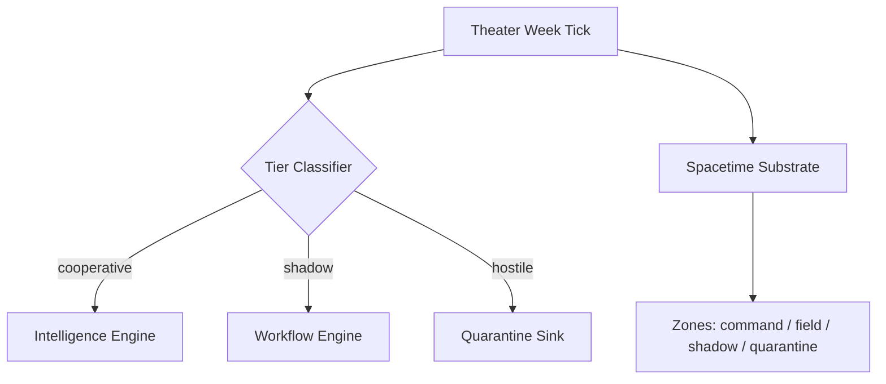

# Paper 04: Embedding Autonomous Agents in Simulated Spacetime

**Authority state:** `INTERNAL_RESEARCH`  
**Claim boundary:** `repo_verified_architecture`  
**Series:** Spatium Computationis / Repo-Native NeuroAI Infrastructure  
**MESIE module:** `mesie/spacetime/`

## Abstract

This paper converts organism-agent and battleground material into a bounded architecture preprint. It studies embedding autonomous agents and operational zones inside a simulated spacetime so that routing, isolation, influence, communication, and quarantine can be represented spatially. Publication remains high-level unless Medina approves the release boundary. The architecture is a **design proposal and experimental framework**, not a verified production security system.

## Distinct thesis

Spatial embedding offers a design language for autonomous-agent coordination in which operational roles, trust boundaries, influence, and quarantine can be modeled as geometric regions and physical interaction rules.

## Contribution surface

- Three-tier signal classification: cooperative, hostile, shadow
- Agent placement as position-bearing entities in a simulated substrate
- Zone definitions as bounded geometric regions with semantic roles
- Influence and communication modeled through force analogies
- Architecture bridge from physical substrate to operational intelligence routing

## Repo implementation

| Component | Path |
|-----------|------|
| Signal tiers | `mesie/spacetime/signals.py` |
| Spatial agents | `mesie/spacetime/agents.py` |
| Zones + policy | `mesie/spacetime/zones.py` |
| Force analogies | `mesie/spacetime/forces.py` |
| Intelligence routing | `mesie/spacetime/routing.py` |
| Tick substrate | `mesie/spacetime/substrate.py` |
| Evaluation | `mesie/spacetime/eval.py` |
| Suite | `python scripts/run_spacetime_suite.py` |

## Bounded public claims

| Claim | Public wording |
|-------|----------------|
| Agents embed in tick-based 3D space | "Resident agents, threats, honeypots, and relays occupy a simulated operational substrate." |
| Tiered routing | "Cooperative, adversarial, and unknown inputs follow distinct route policies." |
| Influence analogy | "Attraction forces model authority/influence between agents — metaphorical, not empirical physics." |
| Production security | **Not claimed.** Repo contains experimental scaffolding only. |

## Mission world integration

Theater week simulation (`mesie/worlds/week_engine.py`) routes every mission tick through `TheaterSpacetimeBridge`:

- Jam / threat / doctrine → signal tier
- Tier + zone policy → intelligence routing target
- Substrate advances one spatial tick per theater tick
- `TickRecord` carries `spacetime_tier`, `spacetime_zone`, `spacetime_action`, `spacetime_route_ok`
- `MissionWorldState.spacetime_summary` aggregates week routing stats

```bash
python scripts/run_mission_world_week.py --days 7
```

## Release-safe architecture diagram

Full preprint diagram: `deliverables/Paper04_Spacetime_Release_Diagram.md`



## Run

```bash
python scripts/run_spacetime_suite.py
python scripts/run_mission_world_week.py --days 7
# or: python -m mesie.tools.cli run spacetime-suite
```

Deliverables:
- `deliverables/Paper04_Spacetime_Architecture_Report.json`
- `deliverables/Paper04_Spacetime_Release_Diagram.md`

## IP / release gate

Before preprint release: agent registry diagram approval, pseudocode for tier classification, simulation traces, threat-model document, IP review of zone names and coordinates. Release diagram uses generic zone names only.